# Tapo-C246D-Dual-Stream-Monitor-PTZ-Controller

Created time: September 7, 2025 7:57 PM

## The Story: Why This Project Exists

TP-Link's Tapo cameras are fantastic. They offer incredible features, great quality, and a price point that's almost impossible to refuse. They are, without a doubt, one of the most competitive brands on the market.

However, like many others, I had some reservations. With growing concerns about data privacy and the fact that Tapo is a brand with roots in China, the thought of where my camera feeds might be going was unsettling. Do I have to choose between an affordable, high-quality camera and my own peace of mind?

I refused to accept that trade-off.

So, I came up with a simple, two-step strategy to get the best of both worlds: the excellent hardware from Tapo and the rock-solid security of a closed-off local system.

1. **Step One: The "Normal" Setup.** First, I set up the camera just as anyone would, using the official Tapo app. This gets the camera connected to my Wi-Fi and ensures all its features are working correctly.
2. **Step Two: The "Airlock".** Next, I logged into my home router and completely **blocked the camera's internet access**. This is the crucial step. The camera can no longer "phone home" or send any data to external servers.

But wait, if the camera is offline, how do I view the feed? The Tapo app stops working, of course.

That's where this project comes in. I wrote this code to run on a device within my home network (like an old laptop or a Raspberry Pi). This application connects directly to the camera over the local network, taps into its video streams using RTSP and ONVIF protocols, and serves a clean, simple web interface that I can access from any browser on my network.

Now, I have a fully functional, high-quality camera system that is completely sandboxed within my home. And for those times I need to check in from outside? A simple port-forwarding rule on my router lets me connect to *my own server*, not the camera's cloud. It's the cheapest, most secure monitoring solution I could ask for.

## Features

- **Dual-Stream Viewing**: Simultaneously view the high-quality PTZ stream and a secondary fixed stream.
- **Full PTZ Control**: A simple web interface to Pan, Tilt, and Zoom the main camera.
- **100% Local**: After initial setup, the camera is completely blocked from the internet. No cloud dependency.
- **Real-time Status Dashboard**: See the connection status for ONVIF, PTZ, and Fixed streams at a glance.
- **Easy to Deploy**: A single Python script built with Flask, OpenCV, and ONVIF-Zeep.
- **Secure Remote Access (Optional)**: Can be securely exposed to the internet via your own router's port forwarding.

## Installation & Setup Guide

Follow these steps carefully to get your secure system up and running.

### Step 1: Initial Tapo Camera Setup

```mermaid
graph TD
    subgraph "Your Home Network"
        UserApp["👤 User (Tapo App)"]
        Router["📡 Home Router"]
        TapoCam["📷 Tapo Camera"]
    end
    subgraph "The Internet"
        TapoCloud["☁️ Tapo Cloud Servers"]
    end

    UserApp -- "Wi-Fi" --> Router
    TapoCam -- "Wi-Fi" --> Router
    Router -- "Two-way sync with the cloud" --> TapoCloud

    linkStyle 2 stroke:green,stroke-width:2px
    classDef default fill:#f9f9f9,stroke:#333,stroke-width:2px;
```

1. **Install the Camera**: Unbox your Tapo camera and power it on.
2. **Use the Tapo App**: Download the official Tapo app on your phone. Follow the instructions to connect the camera to your Wi-Fi network.
3. **Confirm it Works**: Make sure you can view the camera feed and control its PTZ functions from within the Tapo app.
4. **Enable Local Streaming (Crucial!)**:
    - In the Tapo app, go to the camera's settings.
    - Find `Advanced Settings` -> `ONVIF`.
    - Enable the ONVIF toggle.
    - Here, you need to **create a username and password**. This is **NOT** your TP-Link account login. It's a separate account used specifically for local ONVIF/RTSP connections. Remember these credentials!

### Step 2: Isolate The Camera (The "Airlock")

```mermaid
graph TD
    subgraph "Your Home Network"
        Router["📡 Home Router"]
        TapoCam["📷 Tapo Camera"]
    end
    subgraph "The Internet"
        Internet["🌐 Internet"]
    end

    TapoCam -- "Internal network connection is normal" --> Router
    Router -.->|"<b style='color:red'>Firewall Rule:<br>Block this device's outbound traffic</b>"| Internet

    linkStyle 1 stroke-width:4px,stroke:red,stroke-dasharray: 5 5;
```

1. **Find the Camera's IP**: Open the Tapo app and go to the camera's settings to find its local IP address (e.g., `192.168.1.123`). Alternatively, log in to your router's admin panel and find the camera in the list of connected devices. It's a good idea to set a static IP for the camera in your router's DHCP settings so it doesn't change.
2. **Block Internet Access**: Log in to your router's admin panel. The location of this setting varies by manufacturer, but you are looking for **Parental Controls**, **Firewall Rules**, or an **Access Control** menu. Create a new rule that **blocks all WAN/Internet access** for the camera's specific IP address.
3. **Verify the Block**: After applying the rule, try accessing the camera feed from the Tapo app using your phone's cellular data (not Wi-Fi). It should fail to connect. This confirms the camera is successfully isolated.

### Step 3: Prepare the Host Environment

```mermaid
graph TD
    subgraph "The Internet"
        RemoteUser("🌍 Remote User (Optional)")
    end

    subgraph "Your Home Network (LAN)"
        Router("📡 Router / Firewall")
        HostPC("💻 Host Device (PC/RPi)\n[Running Python App]")
        LocalUser("👤 Local User (Browser)")
        TapoCam("📷 Tapo Camera")
    end

    %% --- Main Local Flow ---
    LocalUser -- "3. Browse http://host_ip:5000" --> HostPC
    HostPC -- "4. Control & stream video\nvia ONVIF/RTSP" --> TapoCam

    %% --- Camera's Blocked Path ---
    TapoCam -.-> |"<b style='color:red'>Outbound connection is blocked</b>"| Router

    %% --- Optional Remote Access Flow ---
    RemoteUser -- "1. (Optional) Port Forwarding" --> Router
    Router -- "2. Forward request to host" --> HostPC

    %% --- Styling ---
    style TapoCam fill:#ff9999,stroke:#333,stroke-width:2px
    linkStyle 2 stroke-width:2px,stroke-dasharray: 3,fill:none,stroke:red;
```

This application needs to run on an always-on device on your local network.

1. **Choose a Host Device**: A Raspberry Pi, an old laptop, or any computer that can run Python 3 is perfect.
2. **Install Python**: Ensure Python 3.7 or newer is installed.
3. **Clone This Repository**:Bash
    
    `git clone <your-repository-url>
    cd <repository-folder>`
    
4. **Create a Virtual Environment** (Recommended):Bash
    
    `python3 -m venv venv
    source venv/bin/activate  # On Windows, use `venv\Scripts\activate``
    
5. **Install Dependencies**: The required Python libraries are listed in `requirements.txt`.Bash
    
    `pip install Flask opencv-python onvif-zeep`
    
    *(Note: If you create a `requirements.txt` file with the contents `Flask`, `opencv-python`, and `onvif-zeep`, you can just run `pip install -r requirements.txt`)*
    

### Step 4: Configure and Run the Application

1. **Run the App for the First Time**: The script is designed to automatically create a `config.ini` file for you if it doesn't exist.Bash
    
    `python app.py`
    
2. **Edit `config.ini`**: Stop the script (`Ctrl+C`). A new file named `config.ini` has been created. Open it and edit the following sections:
    - `[camera]`
        - `ip`: The local IP address of your Tapo camera.
        - `onvif_port`: Usually `2020` for Tapo cameras.
        - `username`: The ONVIF username you created in Step 1.
        - `password`: The ONVIF password you created in Step 1.
        - The `rtsp_stream` URLs should update automatically based on the details above, but you can override them if needed.
    - `[server]`
        - `host`: Set to `0.0.0.0` to allow access from any device on your network.
        - `port`: The port the web server will run on (default is `5000`).
3. **Run the App Again**:Bash
    
    `python app.py`
    
    The server should now be running. You will see output in the terminal, and a `camera_debug.log` file will be created for troubleshooting.
    

### Step 5: View Your Secure Stream!

Open a web browser on any device connected to your home network and navigate to:

`http://<IP_of_your_host_device>:5000`

For example, if the computer running the script has an IP of `192.168.1.50`, you would go to `http://192.168.1.50:5000`.

You should now see the dual-camera interface and be able to control the PTZ functions!

### (Optional) Step 6: Remote Access

To access your camera feed from outside your home network:

1. **Log in to your router**.
2. Find the **Port Forwarding** section.
3. Create a new rule to forward an external port (e.g., `5000`) to the internal IP address of your host device and the same port.
    - **External Port**: `5000`
    - **Internal IP**: The IP of the PC/Raspberry Pi running the script (e.g., `192.168.1.50`).
    - **Internal Port**: `5000`
    - **Protocol**: `TCP`

Now, you can access the interface from anywhere by navigating to `http://<your_public_ip_address>:5000`.

**Security Note**: Exposing any service to the internet carries risk. Consider using a non-standard external port for better security (e.g., forward external port `25000` to internal port `5000`). For advanced security, consider setting up a VPN to your home network instead of port forwarding.

